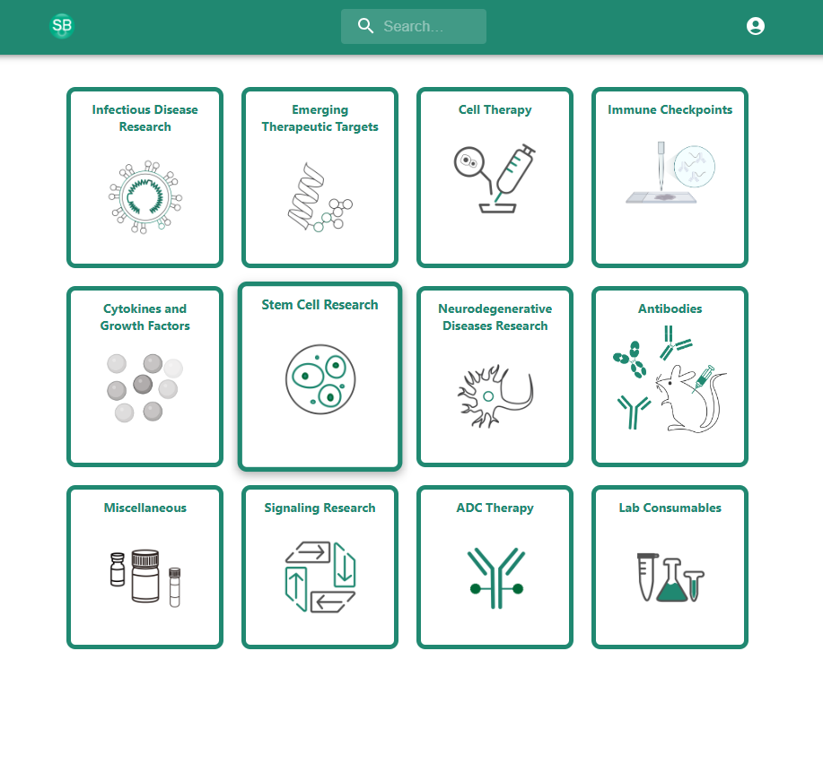
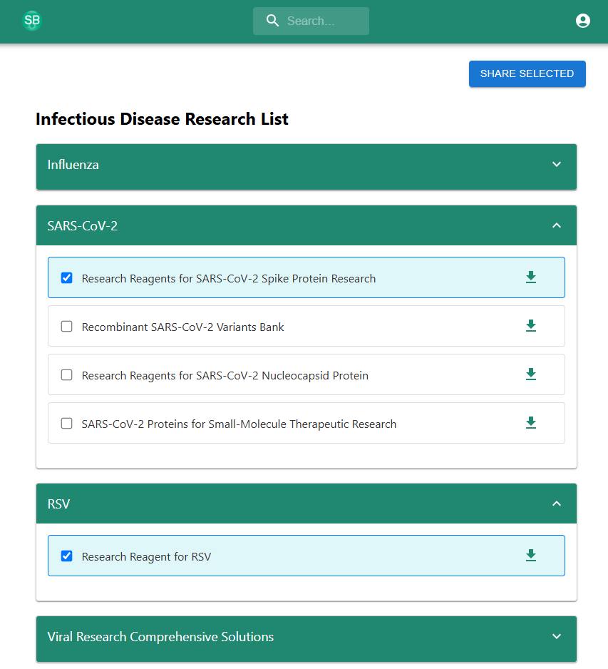

# BioLink

**BioLink** is a secure, internal web application built for the **sales team at Sino Biological US** to easily browse, preview, and share marketing brochures. It serves as a centralized hub for all product brochures, with secure login, fast search, and in-browser PDF viewing.

🔗 **Live Site:** [info.sinobiologicalus.com](https://info.sinobiologicalus.com)

---

## Overview

The application helps sales reps access the latest brochures, filter them by tags or categories, and instantly view or share them—all through a clean, responsive interface.

BioLink is a **full-stack web app** built using:
- **React** for the frontend
- **Node.js + Express** for the backend API
- **MySQL** as the database, managed through **phpMyAdmin**
- **JWT-based user authentication**
- **React-PDF** for inline brochure previewing

---

## Key Features

-  **User Authentication**  
  Login system secured with JWT and bcrypt

-  **Brochure Catalog**  
  Organized, searchable list of brochures by tag/category

-  **PDF Rendering**  
  View brochures directly in the browser using `react-pdf`

-  **MySQL Database**  
  Structured data storage and queries powered by MySQL

-  **phpMyAdmin Integration**  
  Web-based MySQL administration for managing brochure data

-  **Live Search & Filters**  
  Quickly find brochures based on keywords and metadata

-  **Sharable Links**  
  Copy direct brochure links to send to clients

---

##  UI Previews

  
  

---

